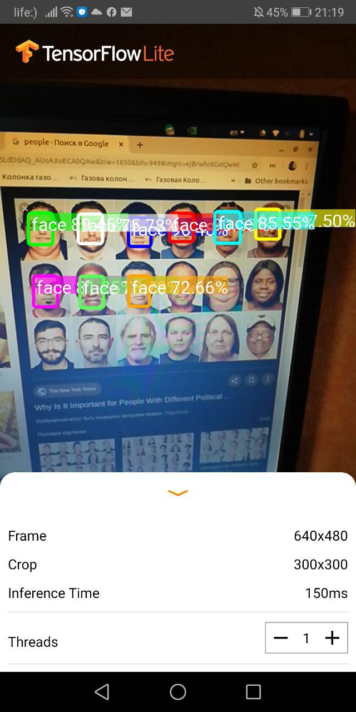

This directory contains three models : 
1) emotions.tflite and labels to it named label_classification.txt, this particular model is the one that classifies emotions.
There is ready to use code for it from tensorflow <a link='https://www.tensorflow.org/lite/models/image_classification/overview'>here</a>. The example of an application used with this model :

2) face_person100.tflite and the related labels name labelmap.txt, the aim of this model is to detect two objects : people, faces. Ready to use code is available <a link='https://www.tensorflow.org/lite/models/object_detection/overview'>here</a>. The example of an application used with this model :

3) age_gender.tflite without labels yet, the aim of which is to predict age and gender. The difficulty of transfering this model is that it has two outputs, age and gender. 
What is more the model solves two problems : regression (age) and classification (gender), thus in order to embed to mobile custom code is madatory.

